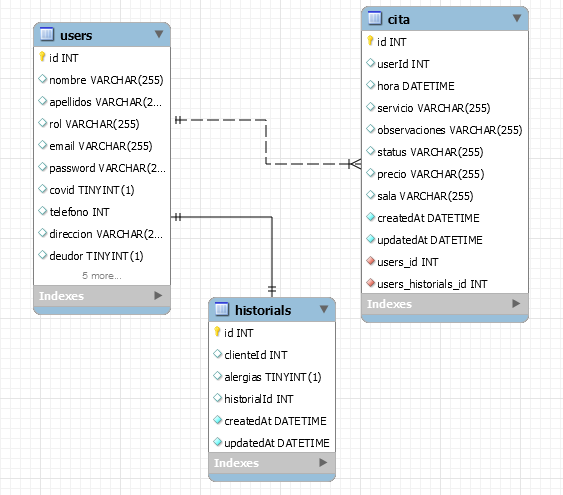

# Clinica dental creada con React
Proyecto creado con *React* como frontend y *NodeJS* y *Express* con *Sequelize* como backend.

**1 - Introducción:** 

Sistema de gestión de citas para una clínica dental que permite a un usuario registrarse, hacer login (y logout) para acceder a su área de cliente desde el navegador.

El usuario puede coger citas dentro del área del cliente.
Puede también anular una cita en concreto.

**2 - Descripción:**

Las vistas son (Frontend):

* Home/Principal.
* Login usuario.
* Registro usuario.
* Muestreo citas del usuario.
* Administración con todas las citas de los usuarios.

Parte de Backend:

* Endpoint para registro de usuarios / http://localhost:3000/api/user/
* Endpoint para login de usuarios / http://localhost:3000/api/user/login
* Endpoint para logout de usuarios / http://localhost:3000/api/user/logout
* Endpoint para listado de citas pendientes / http://localhost:3000/api/cita/Pending
* Endpoint para eliminación de una cita / http://localhost:3000/api/cita/4
* Endpoint para creación de una cita nueva / http://localhost:3000/api/cita/

**3 - Diagrama tablas en workbench:**

 
**4 - Enlace de la API a Heroku:**

https://clinica-dental-react-2.herokuapp.com/

 